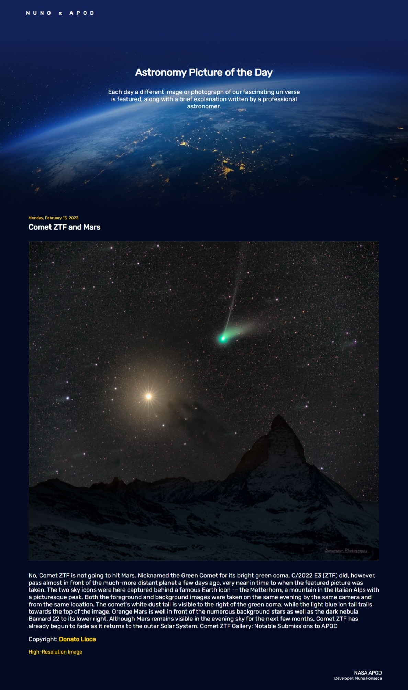

# Astronomy Picture Of The Day

A simple website that fetches the NASA APOD (Astronomy Picture of the Day) API and displays a stunning picture of space along with a brief explanation.
[Website Link](https://astropictureoftheday.vercel.app/)Cancel changes

## Features

-   Displays the latest astronomy picture of the day along with a brief explanation.
-   Link to the High Resolution image
-   Responsive design for optimal viewing on any device.

## Built With

-   HTML
-   CSS
-   JavaScript
-   NASA APOD API

## Contributing

Contributions are always welcome! Please feel free to submit a pull request.

## Acknowledgments

-   NASA APOD API (https://api.nasa.gov/)
-   Inspiration: https://apod.nasa.gov/apod/astropix.html

## Demo

